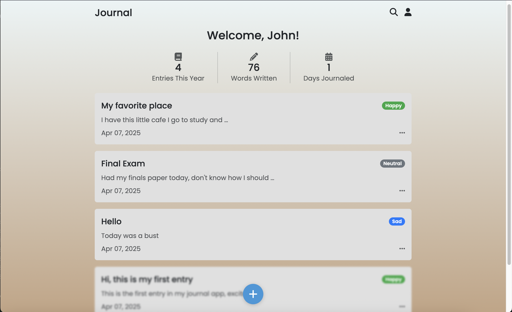

# Journal App

---

## Overview
A simple, elegant journal application built with Django, allowing users to record their thoughts, track their moods, and manage their entries with ease. The app features a clean, user-friendly interface with a gradient background, mood-based entry categorization, and search functionality.

---

## Features
- **User Authentication:** Register, log in, and log out securely.
- **Journal Entries:** Create, edit, and delete journal entries with a title, content, and mood.
- **Mood Tracking:** Categorize entries by mood (Happy, Sad, Neutral) with visual indicators.
- **Search Functionality:** Search entries by title or content.
- **Dashboard:** View all entries with statistics (entries this year, words written, days journaled).
- **Responsive Design:** Works seamlessly on both desktop and mobile devices.
- **Consistent UI:** Gradient background, Poppins font, and a centered layout for a cohesive look.

---

## Technologies Used
- **Backend:** Django 5.x, Python 3.x
- **Frontend:** HTML, CSS, Bootstrap 5.3.0, Font Awesome 6.4.0
- **Database:** SQLite (default; can be configured for PostgreSQL or other databases)
- **Font:** Poppins (via Google Fonts)
- **Dependencies:** Managed via Pipfile

---

## Installation
Follow these steps to set up the Journal App on your local machine.

---

### Prerequisites
- Python 3.8 or higher
- pip (Python package manager)
- virtualenv (optional but recommended)
- Django (installed via Pipfile dependencies)

---

### Steps
1. Clone the Repository:
    ```sh
    git clone https://github.com/Oluwaferanmiii/journal-app.git
    cd journal-app
    ```
2. Install Dependencies
    
    Since the project uses Pipenv, install dependencies by running:
    ```sh
    pipenv install
    ```
3. Activate Virtual Environment
   ```sh
   pipenv shell
   ```
4. Apply Migrations
   ```sh
   python manage.py makemigrations
   python manage.py migrate
   ```
5. Create a Superuser (Optional, for admin access)
   ```sh
   python manage.py createsuperuser
   ```
   Follow the prompts to create an admin user.
6. Run the server
   ```sh
   python manage.py runserver
   ```
   Open your browser and visit http://127.0.0.1:8000/

   if the port is already in use, try:
   ```sh
   python manage.py runserver 8080
   ```
   Open your browser and visit http://127.0.0.1:8080/

---

## Usage
1. Register/Login
    - Navigate to http://127.0.0.1:8000/register/ to create a new account.
    - Log in at http://127.0.0.1:8000/login/.

2. Dashboard:
    - After logging in, you’ll be redirected to the dashboard (/dashboard/).
    - View your entries, statistics (entries this year, words written, days journaled), and click on an entry to edit it.

3. Create/Edit Entries:
    - Click the "+" button at the bottom to create a new entry (/entry/).
    - Select a mood (Happy, Sad, Neutral), enter a title and content, and click "Done" to save.
    - To edit an entry, click on it from the dashboard, make changes, and save.

4. Search Entries:
    - Click the search icon in the header to go to the search page (/search/).
    - Enter a query to filter entries by title or content.

5. Logout:
    - Click the user icon in the header and select "Logout" to sign out.

---

## Project Structure
```sh
journal-app/
│
├── journal/
│   ├── migrations/         # Database migrations
│   ├── templates/
│   │   ├── journal/
│   │   │   ├── dashboard.html  # Dashboard template
│   │   │   ├── entry.html      # Entry creation/editing template
│   │   └── └── ...             # Other templates
│   ├── __init__.py
│   ├── admin.py            # Admin panel configuration
│   ├── apps.py             # App configuration
│   ├── models.py           # Database models (JournalEntry)
│   ├── tests.py            # Test cases
│   ├── urls.py             # App-specific URLs
│   └── views.py            # View functions
│
├── templates/
│   └── base.html           # Base template with shared styles
│ 
├── journal_app/
│   ├── __init__.py
│   ├── asgi.py             # ASGI configuration
│   ├── settings.py         # Project settings
│   ├── urls.py             # Project-wide URLs
│   └── wsgi.py             # WSGI configuration
│
├── manage.py               # Django management script
├── Pipfile                 # Project dependencies
├── Pipfile.lock
└── README.md               # Project documentation
```

---

## Key Files
- models.py: Defines the JournalEntry model with fields for user, title, content, mood, and created_at.
- views.py: Contains views for the dashboard, entry creation/editing, search, and authentication.
- dashboard.html: Displays the user’s entries, statistics, and search functionality.
- entry.html: Form for creating or editing journal entries with a mood selector.
- base.html: Base template with shared styles (gradient background, Poppins font, Bootstrap).

---

## Screenshots
### Register 


### Login 


### Dashboard 


### New Entry


### Search


---

## Contributing
Contributions are welcome! To contribute:

1. Fork the repository.
2. Create a new branch (git checkout -b feature/your-feature).
3. Make your changes and commit them (git commit -m "Add your feature").
4. Push to your branch (git push origin feature/your-feature).
5. Open a pull request.

Please ensure your code follows the project’s style guidelines and includes appropriate tests.

---

## License
This project is licensed under the MIT [License](LICENSE). See the file for details.